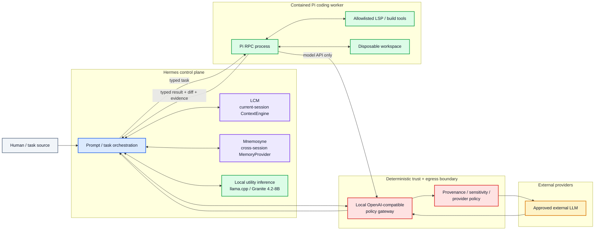
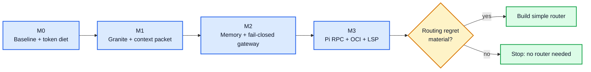

# Architecture Overview

Status: `specified`

This page is a compact human/agent map. Normative behavior lives in `docs/specs/` and execution order lives in root `TASKS.md`.

## System boundary

Color is redundant with text labels:

- **Blue — control:** Hermes orchestration.
- **Purple — context/memory:** LCM and Mnemosyne, with separate authority.
- **Green — contained/local execution:** local inference and Pi worker resources.
- **Red — enforcement boundary:** deterministic egress/provider policy.
- **Amber — external:** provider outside the local trust boundary.
- **Grey — human/evidence edge:** task/review source.

## Invariants

1. **One current-session context authority.** LCM may compact/select/recover current-session evidence; Mnemosyne does not create a competing transcript hierarchy.
2. **One durable-memory authority.** Mnemosyne holds curated cross-session memories; the same bank is not injected through multiple Hermes integration paths by default.
3. **Raw evidence remains recoverable.** Local compression/context packets carry provenance and retrieval pointers.
4. **Mandatory egress policy is fail closed.** Hermes fail-open hooks/middleware can contribute signals but cannot be the only deny boundary.
5. **External provider credentials do not belong in the contained Pi worker.** Worker model calls go through the policy gateway.
6. **Pi does not edit the canonical repository directly.** It operates on a disposable workspace and returns a diff/evidence package.
7. **Objective verification beats model judging where available.** Schema validation, compiler/tests and LSP diagnostics are preferred acceptance signals.
8. **Routing is optional.** The system works without a learned router; routing is built only if accumulated telemetry proves recoverable economic regret.

## Data-flow classification

| Flow | Default trust/sensitivity posture | Enforcement |
|---|---|---|
| Human → Hermes | trusted input but may contain sensitive data | provenance + egress classification |
| Repo/web/tool → Hermes | bounded/untrusted | never authorizes privileged action by itself |
| LCM/Mnemosyne → Hermes | persisted local evidence with provenance | budgeted injection; no automatic authority escalation |
| Hermes → local utility model | local/private | no external egress required |
| Hermes/Pi → policy gateway | policy-controlled | deterministic checks before provider connection |
| Gateway → external LLM | outside local trust boundary | minimized/approved payload only |
| Hermes → Pi | typed bounded task | sandbox, path/tool/network allowlist |
| Pi → Hermes | untrusted generated result until verified | diff/tests/LSP/schema evidence |

## Build sequence

Each milestone can stop/reject a component without invalidating the entire architecture. `Routing not needed`, `Mnemosyne not paying for itself`, or `Q5 not needed` are valid outcomes rather than failures of the project.

## Normative references

- `docs/specs/local-model-admission.md`
- `docs/specs/m2-context-memory-security.md`
- `docs/specs/m3-pi-worker-rpc.md`
- `docs/build-readiness.md`
- root `TASKS.md`
